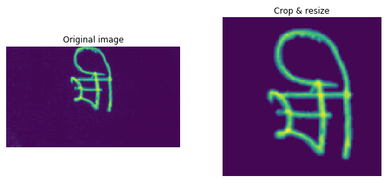

# Data Pre-processing

The images are stored in a columnar data format, `parquet`. It is like CSV, but it is a specialized format for columnar data to achieve higher performance. `Pandas` provides a handy `read_parquet` method read this file.

```python
df = pd.read_parquet(TRAIN[0])
```

## Display images 

The following code block is about plotting an original and pre-processed images on the left and the right sides respectively. The `subplots` method creates `n_imgs` * 2 numbers of sub-plots. The number of rows and columns are indicated by the `1st` and `2nd` parameters respectively. The `figsize` parameter determines the size of the entire plot in `inch`. The size has to be specified with width and height in order.

```python
n_imgs   = 8                         
fig, axs = plt.subplots(n_imgs, 2, figsize=(10, 5*n_imgs))

for idx in range(n_imgs):
    img0 = 255 - df.iloc[idx, 1:].values.reshape(HEIGHT, WIDTH).astype(uint8)
    img = get_crop_resize(img0)

    axs[idx,0].imshow(img0, cmap='gray')
    axs[idx,0].set_title('Original image') 
    axs[idx,0].axis('off') 
    axs[idx,1].imshow(img, cmap='gray') 
    axs[idx,1].set_title('Crop & resize') 
    axs[idx,1].axis('off') 
plt.show()
```

The `img0` is an original image while the `img` is the pre-processed one. The original data has a number of columns, and the very first column is used to indicate image ids. In such sense, it is possible to collect every columns except for the first one via `df.iloc[idx, 1:]`. That is we could retrieve every pixel values of a specific `idx`-th image.

Then `df.iloc[idx, 1:].values` convert the values stored in the dataframe columns into numpy array. It is ok to go with this, but it has to be reshaped into 2d array if you want to leverage some CNN models. This can be done by `reshape` method with `HEIGHT` and `WIDTH` parameters. `HEIGHT` * `WIDTH` is the exact same number of the number of columns.




```python
def get_crop_resize(img0):
    #normalize each image by its max val
    img = (img0*(255.0/img0.max())).astype(np.uint8) 
    img = crop_resize(img) 
    
    return img
```

```python
def crop_resize(img0, size=SIZE, pad=16):
    img, lx, ly = cropped_img(img0)
    img = padded_img(img, lx, ly, pad)
    return cv2.resize(img,(size,size))
```

```python
def cropped_img(img0, thres=80):
    ymin,ymax,xmin,xmax = bbox(img0[5:-5, 5:-5] > thres)

    xmin = xmin - 13 if (xmin > 13) else 0
    ymin = ymin - 10 if (ymin > 10) else 0
    xmax = xmax + 13 if (xmax < WIDTH - 13) else WIDTH
    ymax = ymax + 10 if (ymax < HEIGHT - 10) else HEIGHT
    img = img0[ymin:ymax, xmin:xmax]
    img[img < 28] = 0

    lx = xmax - xmin
    ly = ymax - ymin

    return img, lx, ly
```

```python
def padded_img(img, lx, ly, pad):
    l = max(lx,ly) + pad
    img = np.pad(img, [((l-ly)//2,), ((l-lx)//2,)], mode='constant')

    return img
```

```python
def bbox(img):
    rows = np.any(img, axis=1)
    cols = np.any(img, axis=0)
    rmin, rmax = np.where(rows)[0][[0, -1]]
    cmin, cmax = np.where(cols)[0][[0, -1]]
    return rmin, rmax, cmin, cmax
```

# Modelling
