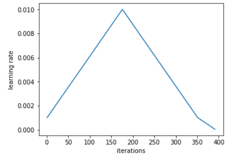

# Data Pre-processing

The images are stored in a columnar data format, `parquet`. It is like CSV, but it is a specialized format for columnar data to achieve higher performance. `Pandas` provides a handy `read_parquet` method read this file.

```python
df = pd.read_parquet(TRAIN[0])
```

## Display images 

The following code block is about plotting an original and pre-processed images on the left and the right sides respectively. The `subplots` method creates `n_imgs` * 2 numbers of sub-plots. The number of rows and columns are indicated by the `1st` and `2nd` parameters respectively. The `figsize` parameter determines the size of the entire plot in `inch`. The size has to be specified with width and height in order.

```python
n_imgs   = 8                         
fig, axs = plt.subplots(n_imgs, 2, figsize=(10, 5*n_imgs))

for idx in range(n_imgs):
    img0 = 255 - df.iloc[idx, 1:].values.reshape(HEIGHT, WIDTH).astype(uint8)
    img = get_crop_resize(img0)

    axs[idx,0].imshow(img0, cmap='gray')
    axs[idx,0].set_title('Original image') 
    axs[idx,0].axis('off') 
    axs[idx,1].imshow(img, cmap='gray') 
    axs[idx,1].set_title('Crop & resize') 
    axs[idx,1].axis('off') 
plt.show()
```

The `img0` is an original image while the `img` is the pre-processed one. The original data has a number of columns, and the very first column is used to indicate image ids. In such sense, it is possible to collect every columns except for the first one via `df.iloc[idx, 1:]`. That is we could retrieve every pixel values of a specific `idx`-th image.

Then `df.iloc[idx, 1:].values` convert the values stored in the dataframe columns into numpy array (the same thing could be done with `to_numpy` method). It is ok to go with this, but it has to be reshaped into 2d array if you want to leverage some CNN models. This can be done by `reshape` method with `HEIGHT` and `WIDTH` parameters. `HEIGHT` * `WIDTH` is the exact same number of the number of columns.

The reason for subtracting pixel values from `255` is that the original image is kind of being inverted. The background color is white which is near `255` or `#ffffff`value. It is possible to use it directly, but two high numbers are not so good to train the model. Instead the interesting pixels (like where the number image is) should have higher value.


After retrieving the image pixel array from the dataframe, we can crop and resize the image. The main purpose of this task could be described with the Picture above. The hand written character in the original image is not centered, and there are plenty of marginal space which is useless for this kind of data. It is better to cut the unnecessary space and position the character part centered.

## Crop and Resizing

```python
def get_crop_resize(img0):
    #normalize each image by its max val
    img = (img0*(255.0/img0.max())).astype(np.uint8) 
    img = crop_resize(img) 
    return img
```

Inside the `get_crop_resize` function, the actual cropping and resizeing function is located. That is where the actual process gets happened via `crop_resize` function. `(img0*(255.0/img0.max()))` part is just normalization process. (not sure yet). Let's inspect the `crop_resize` function in more detail.

```python
def crop_resize(img0, size=SIZE, pad=16):
    img, lx, ly = cropped_img(img0)
    img = padded_img(img, lx, ly, pad)
    return cv2.resize(img,(size,size))
```

As you can see, `crop_resize` function does three things. First, make the image cropped. Second, some small background pixels are padded to to make sure every images are in the same size. For instance, if the height is longer than width, the width will be padded to expand the size. Lastly, the image gets resized to become a desired size.

```python
def cropped_img(img0, thres=80):
    ymin,ymax,xmin,xmax = bbox(img0[5:-5, 5:-5] > thres)

    xmin = xmin - 13 if (xmin > 13) else 0
    ymin = ymin - 10 if (ymin > 10) else 0
    xmax = xmax + 13 if (xmax < WIDTH - 13) else WIDTH
    ymax = ymax + 10 if (ymax < HEIGHT - 10) else HEIGHT
    img = img0[ymin:ymax, xmin:xmax]
    img[img < 28] = 0

    lx = xmax - xmin
    ly = ymax - ymin

    return img, lx, ly
```

Let's look into the `cropped_img` function. The `bbox` function will be explained shortly, but the returned values are the indicies where the pixel value is above the `thres`. Since there could be some noisy values, the `thres` is set to `80` here. So, `ymin` and `ymax` are the pixel location of bottom and top respectively where the value exceeds 80. Likewise, `xmin` and `xmax` are the pixel location of left and right.

The four lines of code with `+/-13` and `+/-10` things are attempts to give some extra space so that the charater of the image can be centered. It will prevent the character from being located at the exact corners.

`img[img < 28] = 0` erase some noisy pixel values. Finally, `lx` and `ly` is the size of width and height. The same thing could be achieved via `img.shape` I guess. These values will be used to determine which size should be padded and how much in `padded_img` function below.

```python
def padded_img(img, lx, ly, pad):
    l = max(lx,ly) + pad
    img = np.pad(img, [((l-ly)//2,), ((l-lx)//2,)], mode='constant')

    return img
```

`padded_img` function performs padding. First, `max(ly, ly)` deteremines wheter width or height should be padded more. `+pad` gives more space additionally. You can get some sense what np.pad does through the following exmaple.

```
>>> a = [[1, 2], [3, 4]]
>>> np.pad(a, ((3, ), (2, )), mode='constant')
array([[0, 0, 0, 0, 0, 0],
       [0, 0, 0, 0, 0, 0],
       [0, 0, 0, 0, 0, 0],
       [0, 0, 1, 2, 0, 0],
       [0, 0, 3, 4, 0, 0],
       [0, 0, 0, 0, 0, 0],
       [0, 0, 0, 0, 0, 0],
       [0, 0, 0, 0, 0, 0])
```

The original values were `[[1,2],[3,4]]`, and you could find it on the center of the resuling array. As you can see, three rows are added to the top and bottom, and two columns are added to the left and right to surroung the original values.

In this sense, `np.pad(img, [((l-ly)//2,), ((l-lx)//2,)], mode='constant')` pads evenly to the every directions (note `//2` operation). When mode is `constant` the padded values are `0`. 


```python
def bbox(img):
    rows = np.any(img, axis=1)
    cols = np.any(img, axis=0)
    rmin, rmax = np.where(rows)[0][[0, -1]]
    cmin, cmax = np.where(cols)[0][[0, -1]]
    return rmin, rmax, cmin, cmax
```

The last function we will look at is `bbox`. Remeber this function was used in the first line of the `crop_resize` function. The input parameter `img` is not an actual image, but it is assumed to be an boolean array with the same size to the original image. In such array, we could find easily where the pixels of our interests are located, and that is done with `np.where` functionality.  

`np.where` returns the indices of array indicating the location where the `True` values are. `np.where(rows)[0]`'s [0] is just to access the array. `[[0, -1]]` thing will give you the first and the last indices from the array. So you now know the location of the starting pixel for the character.

### References
- [Apache Parquet](http://parquet.apache.org/)
- [Pandas pd.read_parquet](https://pandas.pydata.org/pandas-docs/stable/reference/api/pandas.read_parquet.html)
- [Pandas Series values property](https://pandas.pydata.org/pandas-docs/stable/reference/api/pandas.Series.values.html)
- [np.pad](https://docs.scipy.org/doc/numpy/reference/generated/numpy.pad.html)
- [np.any](https://docs.scipy.org/doc/numpy/reference/generated/numpy.any.html)
- [np.where](https://docs.scipy.org/doc/numpy/reference/generated/numpy.where.html)

### What I don't fully understand
- Standardization v.s. Normalization
- Methods for Normalization

# Modelling

Before modelling, we need to set some fixed parameters like `batch_size` and `size` for the image size. Also `TRAIN` and `LABELS` simply reference the locations where the training images and labeling information files are respectively. `arch` means the model architecture, so one or the most popular one, `DenseNet121` will be used to train. `nfolds` and `fold` are to determine the index to split between training and validation datasets.

```python
size        = 128
batch_size  = 128

nfolds      = 4 
fold        = 0

TRAIN       = '../input/grapheme-imgs-128x128/'
LABELS      = '../input/bengaliai-cv19/train.csv'

arch        = models.densenet121
```

## Training

This post's approach is top to bottom. That means I am going to dig into training part first, and then inspect things such as `DataBunch`, `Model`, `Loss function`, `Metrics`, `Callbacks`, and more that are used in training part in more detail.

By saying that, let's look what training procedure looks like first. 

In order to run training procedure, we need a `Learner`. In `Learner` instance, some parameters are specified. `data` is a `DataBunch` kind of instance. `DataBunch` is a wrapper class for `Datasets` and `DataLoader` in PyTorch. It manages training, validation, and test datasets in one place along with loading process. The actual process to build `DataBunch` will be covered shortly.

`model` is an instance of `Dnet_1ch` class. We will take a look in more detail, but `Dnet_1ch` is a transformed version of DenseNet121. The original DenseNet121 is originally designed to take three channel (RGB) images as an input, but Bangali MNIST dataset is one channel images. So `Dnet_1ch` modifies the first layer so that it could embrace the on channel images.

Another change made in `Dnet_1ch` class is that some additional layers such as fully connected layer are added as the last layers since we are going to perform transfer learning. 

```python
model = Dnet_1ch()
learn = Learner(data, 
                model, 
                loss_func=Loss_combine(),
                opt_func=Over9000,
                metrics=[Metric_grapheme(), Metric_vowel(),
                         Metric_consonant(),Metric_tot()])
                         
logger = CSVLogger(learn, f'log{fold}')
learn.clip_grad = 1.0
learn.split([model.head1])
```

The third parameter `loss_func` is used to specify a loss function. A custom loss function is defined, and its name is `Loss_combine`. Bangali MNIST is a multilabel classification problem, so there should be three different outputs to be measured. `Dnet_1ch` model's output actually has three different fully connected layers separately. `Loss_combine` function simply adds up losses from those separate layers.

We will see the custom metrices of `Metric_grapheme`, `Metric_vowel`, `Metric_consonant`, and `Metric_tot` shortly. Basically, each of them displays the amount of loss to the corresponding classification results. 

`CSVLogger` is justa callback to leave a log file while training. It will be passed when the actual training begins. `learn.clip_grad` is a way to limit the value of gradient in order to prevent exploding gradient problem. `learn.split` is a fastai mechanism to split the whole model into groups. `model.head1` is the splitting point where the DenseNet121 part is over and additional fully connected layers are attatched.

```python
learn.fit_one_cycle(32, 
                    max_lr=slice(0.2e-2,1e-2), 
                    wd=[1e-3,0.1e-1], 
                    pct_start=0.0, 
                    div_factor=100, 
                    callbacks = [logger, 
                                 MixUpCallback(learn),
                                 SaveModelCallback(learn, monitor='metric_tot',         
                                                   mode='max',name=f'model_{fold}')])
```

`learn.fit_one_cycle` is a most commonly used training method in fastai. It uses a cyclical learning rate strategy behind the scene. To simply explain, the cyclical learning rate is that the learning rate starts from high, and it goes down slowly to the low value. This process happens multiple times, and each time is called a cycle. `fit_one_cycle` is a specific case of the cyclical learning rate which use only one cycle with a bit of tweak.

The first argument `32` indicates the number of epochs. The second argument `max_lr` indicates the learning rates, but when we pass slice thing, it is possible to apply different learning rates to different groups of layers. Remember we have split the model into two groups by `learn.split` method before.

The third argument `pct_start` is the percentage of total number of epochs when learning rate rises during one cycle. The figure below shows an idea how the learning rate gets changed in `fit_one_cycle`. By setting `pct_start=0.0`, the peak just starts right away when the training gets started.



The fourth argument `div_factor` sets the starting learning rate. Internally, the learning rates rise from `max_lr/div_factor` to the `max_lr`s. The default is set to 25.0.

The last argument is to set a number of callbacks. Callbacks in fastai lets you insert any kind of additional logic in any given points of training time. `logger` is the `CSVLogger` that we have created before. `MixUpCallback` is a data augmentation technique to mix up multiple images from multiple different kinds of labels. This helps to increase the model's generalization. `SaveModelCallback` is to save model where a certain metric has better value. This is the default look. `SaveModelCallback(learn:Learner, monitor:str='valid_loss', mode:str='auto', every:str='improvement', name:str='bestmodel')`

## Building a DataBunch

`DataBunch` is a high level wrapper for PyTorch's Dataset and DataLoader. It holds training, validation, and testing(optional) datasets internally. It could be built from Pandas DataFrame, CSV files, image directories, and so on. 

The code block shows how to create on with `ImageList` class. Some methods like `from_df`, `split_by_idx`, `label_from_df`, , `transform`, and `databunch` are called by chaining. 

`from_df` means that you want to build a DataBunch from Pandas DataFrame. You pass the target dataframe as `df`, and the folder name where the actual images are stored as `folder`, and `suffix` to tell which image format is going to be used. The `cols` argument is used to indicate which columns in the DataFrame have the list of image filenames. `convert_mode` is set to tell if the images are RGB color or grayscale. `L` means the grayscale while `RGB` means the RGB.

```python
stats = ([0.0692], [0.2051])

data = (ImageList.from_df(df, path='.', folder=TRAIN, suffix='.png', 
                          cols='image_id', convert_mode='L')
                 .split_by_idx(range(fold*len(df)//nfolds,
                                     (fold+1)*len(df)//nfolds))
                 .label_from_df(cols=['grapheme_root',
                                      'vowel_diacritic',
                                      'consonant_diacritic'])
                 .transform(get_transforms(do_flip=False, max_warp=0.1), 
                            size=sz, padding_mode='zeros')
                 .databunch(bs=bs))
        .normalize(stats)

data.show_batch()
```

`split_by_idx` is an method to split the whole dataset into training and validation datasets. The specified range of indicies is used to tell where the validation dataset comes from.

`label_from_df` is an method to specify labels from Pandas DataFrame. You could list multiple labels from multiple columns when you are dealing with multilabel classification task. The code block above means that we are dealing with multilabel classification task, and there are three label kinds, `grapheme_root`, `vowel_diacritic`, and `consonant_diacritic`.

`transform` is an method to specify a set of transformation(augmentation) rules. fastai provides a handy function called `get_transforms`. With it, you just need to pass a number of parameters of how you want to augment your data. Then `get_transforms` will return a list of Transform.

Finally, `databunch` is a method to wrap the whole thing into a `DataBunch`. Nothing special, but you could specify thie batch size. 

After this, when you call `data.show_batch()`, you will see some samples of the data without any matplotlib codes yourself. 


## Buiilding a Custom Model

There are two options for building a model. One is to simply use an existing one by expanding the only channel to three. Another option is to convert an existing one to embrace 1 channel image. In this note, the latter case is covered (the original architecture of DenseNet121 takes three channels).

```python
df      = pd.read_csv(LABELS)
nunique = list(df.nunique())[1:-1]
```

We have two classes. One is `Head`, and the other is `Dnet_1ch`. `Head` is a part of the `Dnet_1ch`, and `Dnet_1ch` is a modified version of DenseNet121. More specifically, `Head` is defined to be added as a fully connected layer to the end of convolutional blocks in DenseNet121. 

```python
class Head(nn.Module):
    def __init__(self, nc, n, ps=0.5):
        super().__init__()
        layers = [AdaptiveConcatPool2d(), Mish(), Flatten()] + \
                  bn_drop_lin(nc*2, 512, True, ps, Mish()) + \
                  bn_drop_lin(512, n, True, ps)
                  
        self.fc = nn.Sequential(*layers)
        self._init_weight()
        
    def _init_weight(self):
        for m in self.modules():
            if isinstance(m, nn.Conv2d):
                torch.nn.init.kaiming_normal_(m.weight)
            elif isinstance(m, nn.BatchNorm2d):
                m.weight.data.fill_(1.0)
                m.bias.data.zero_()
        
    def forward(self, x):
        return self.fc(x)

#change the first conv to accept 1 chanel input
class Dnet_1ch(nn.Module):
    def __init__(self, arch=arch, n=nunique, pre=True, ps=0.5):
        super().__init__()
        m = arch(True) if pre else arch()
        
        conv        = nn.Conv2d(1, 64, kernel_size=7, stride=2, padding=3, bias=False)
        weight      = (m.features.conv0.weight.sum(1)).unsqueeze(1)
        conv.weight = nn.Parameter(weight)
        
        self.layer0 = nn.Sequential(conv, m.features.norm0, nn.ReLU(inplace=True))
        self.layer1 = nn.Sequential(
            nn.MaxPool2d(kernel_size=3, stride=2, padding=1, dilation=1, ceil_mode=False),
            m.features.denseblock1)
        self.layer2 = nn.Sequential(m.features.transition1,m.features.denseblock2)
        self.layer3 = nn.Sequential(m.features.transition2,m.features.denseblock3)
        self.layer4 = nn.Sequential(m.features.transition3,m.features.denseblock4,
                                    m.features.norm5)
        
        nc = self.layer4[-1].weight.shape[0]
        self.head1 = Head(nc,n[0])
        self.head2 = Head(nc,n[1])
        self.head3 = Head(nc,n[2])
        
    def forward(self, x):    
        x = self.layer0(x)
        x = self.layer1(x)
        x = self.layer2(x)
        x = self.layer3(x)
        x = self.layer4(x)
        
        x1 = self.head1(x)
        x2 = self.head2(x)
        x3 = self.head3(x)
        
        return x1,x2,x3
```

As you can see, `m = arch(True) if pre else arch()`, the very first line of `Dnet_1ch` class, will import DenseNet121 from PyTorch model. 

From the second line to fourth line of code replaces the original DenseNet121's first convolutional layer to embrace the 1 channel image. The `nn.Conv2d` is the same, but there are only one channel input. The `weight` is simply the sum of the kernels from the original version. `nn.Parameter` makes the `wieght` learnable.

Rest of the pieces until `self.head1` is the same thing. Three `Head` layer thing are added separately which means they don't share information since each one of them will classify different things simultaneously. 


# Loss & Metrics & Callbacks

## Building a Custom Loss

The forward pass in the `Dnet_1ch` returns three things for three different classification results. It is easy to measure the loss of the indivisual output. However, we need a way to combine all of three. One easy way to achieve this is to just add them up.

```python
class Loss_combine(nn.Module):
    def __init__(self):
        super().__init__()
        
    def forward(self, input, target,reduction='mean'):
        x1,x2,x3 = input
        x1,x2,x3 = x1.float(), x2.float(), x3.float()
        
        y = target.long()
        
        return 0.7*F.cross_entropy(x1,y[:,0],reduction=reduction) + 
               0.1*F.cross_entropy(x2,y[:,1],reduction=reduction) +
               0.2*F.cross_entropy(x3,y[:,2],reduction=reduction)
```

x1, x2, and x3 are `grapheme_root`, `vowel_diacritic`, and `consonant_diacritic` respectively. `0.7`, `0.1`, and `0.2` are weights for the different components. You could try different numbers as long as the sum of them equals to `1.0`. I assume  that the first one has much higher weights since `grapheme_root` has a way more classes to calssify than others. (168 vs 11 vs 7)

## Building Custom Metrics

Metric is an assessment to represent how well the model is learning other than loss. Different task might require different metric or metrices. This competition asks to use hierarchical macro average recall. 

> Submissions are evaluated using a hierarchical macro-averaged recall. First, a standard macro-averaged recall is calculated for each component (grapheme root, vowel diacritic, or consonant diacritic). The final score is the weighted average of those three scores, with the grapheme root given double weight. You can replicate the metric with the following python snippet:

```python
# provided code snippet from the Kaggle competition
import numpy as np
import sklearn.metrics

scores = []
for component in ['grapheme_root', 'consonant_diacritic', 'vowel_diacritic']:
    y_true_subset = solution[solution[component] == component]['target'].values
    y_pred_subset = submission[submission[component] == component]['target'].values
    scores.append(sklearn.metrics.recall_score(
        y_true_subset, y_pred_subset, average='macro'))
        
final_score = np.average(scores, weights=[2,1,1])
```

According to the official code snippet, we need to calculate a weighted average recall, and its average model macro. You might wonder mean of what. Remember that we calculate three different recall values from three different outputs for three different components (grapheme root, vowel diacritic, consonant diacritic).

The follwing code exactly does this. Just forget about the detail on `Metric_idx` for now but think each one of them is the recall value for the corresponding components. `Metric_tot` whose actual name is `Metric_total` calculates the hierarchical macro-averaged recall. As you can see from the `on_epoch_end` method in it, it also reflects the requirements `The final score is the weighted average of those three scores, with the grapheme root given double weight`. The value for the grapheme_root is as twice as the others. 

```python
Metric_grapheme     = partial(Metric_idx,0)
Metric_vowel        = partial(Metric_idx,1)
Metric_consonant    = partial(Metric_idx,2)

class Metric_tot(Callback):
    def __init__(self):
        super().__init__()
        self.grapheme   = Metric_idx(0)
        self.vowel      = Metric_idx(1)
        self.consonant  = Metric_idx(2)
        
    def on_epoch_begin(self, **kwargs):
        self.    grapheme.on_epoch_begin(**kwargs)
        self.       vowel.on_epoch_begin(**kwargs)
        self.   consonant.on_epoch_begin(**kwargs)
    
    def on_batch_end(self, last_output:Tensor, last_target:Tensor, **kwargs):
        self.    grapheme.on_batch_end(last_output, last_target, **kwargs)
        self.       vowel.on_batch_end(last_output, last_target, **kwargs)
        self.   consonant.on_batch_end(last_output, last_target, **kwargs)
        
    def on_epoch_end(self, last_metrics, **kwargs): 
        return add_metrics(last_metrics, 0.5*self.grapheme._recall() +
                0.25*self.vowel._recall() + 0.25*self.consonant._recall())
```

I guess this work is done to embrace `the hierarchical macro-averaged recall` thing into PyTorch. But you get the idea. Just one thing to notice is that any kind of metric is implemented as a Callback in fast.ai library which provides much flexible way to insert logics at any given point of traning phases.

`Metric_tot` contains three different `Metric_idx` instances which are also a kind of Callback.

```python
class Metric_idx(Callback):
    def __init__(self, idx, average='macro'):
        super().__init__()
        self.idx        = idx
        self.n_classes  = 0
        self.average    = average
        self.cm         = None
        self.eps        = 1e-9
        
    def on_epoch_begin(self, **kwargs):
        self.tp = 0
        self.fp = 0
        self.cm = None
    
    def on_batch_end(self, last_output:Tensor, last_target:Tensor, **kwargs):
        last_output = last_output[self.idx]
        last_target = last_target[:,self.idx]
        preds       = last_output.argmax(-1).view(-1).cpu()
        targs       = last_target.long().cpu()
        
        if self.n_classes == 0:
            self.n_classes  = last_output.shape[-1]
            self.x          = torch.arange(0, self.n_classes)
            
        cm = ( (preds==self.x[:, None]) & (targs==self.x[:, None, None]) )
             .sum(dim=2, dtype=torch.float32)
             
        if self.cm is None: self.cm =  cm
        else:               self.cm += cm

    def _weights(self, avg:str):
        if self.n_classes != 2 and avg == "binary":
            avg = self.average = "macro"
            warn("average=`binary` was selected for a non binary case. \
                 Value for average has now been set to `macro` instead.")
        if avg == "binary":
            if self.pos_label not in (0, 1):
                self.pos_label = 1
                warn("Invalid value for pos_label. It has now been set to 1.")
            if self.pos_label == 1: return Tensor([0,1])
            else: return Tensor([1,0])
        elif avg == "micro": return self.cm.sum(dim=0) / self.cm.sum()
        elif avg == "macro": return torch.ones((self.n_classes,)) / self.n_classes
        elif avg == "weighted": return self.cm.sum(dim=1) / self.cm.sum()
        
    def _recall(self):
        rec = torch.diag(self.cm) / (self.cm.sum(dim=1) + self.eps)
        if self.average is None: return rec
        else:
            if self.average == "micro": weights = self._weights(avg="weighted")
            else: weights = self._weights(avg=self.average)
            return (rec * weights).sum()
    
    def on_epoch_end(self, last_metrics, **kwargs): 
        return add_metrics(last_metrics, self._recall())
```

I will revisit the details of the code block above later. This is an implementation detail for a specific metric. Indeed, we need this, but it is provided nicely by @Iafoss.

## Building a Custom Callback
```python
#fix the issue in fast.ai of saving gradients along with weights
#so only weights are written, and files are ~4 times smaller

class SaveModelCallback(TrackerCallback):
    "A `TrackerCallback` that saves the model when monitored quantity is best."
    def __init__(self, learn:Learner, monitor:str='valid_loss', mode:str='auto',
                 every:str='improvement', name:str='bestmodel'):
        super().__init__(learn, monitor=monitor, mode=mode)
        self.every,self.name = every,name
        if self.every not in ['improvement', 'epoch']:
            warn(f'SaveModel every {self.every} is invalid, falling back to "improvement".')
            self.every = 'improvement'
                 
    def jump_to_epoch(self, epoch:int)->None:
        try: 
            self.learn.load(f'{self.name}_{epoch-1}', purge=False)
            print(f"Loaded {self.name}_{epoch-1}")
        except: print(f'Model {self.name}_{epoch-1} not found.')

    def on_epoch_end(self, epoch:int, **kwargs:Any)->None:
        "Compare the value monitored to its best score and maybe save the model."
        if self.every=="epoch": 
            #self.learn.save(f'{self.name}_{epoch}')
            torch.save(learn.model.state_dict(),f'{self.name}_{epoch}.pth')
        else: #every="improvement"
            current = self.get_monitor_value()
            if current is not None and self.operator(current, self.best):
                #print(f'Better model found at epoch {epoch} \
                #  with {self.monitor} value: {current}.')
                self.best = current
                #self.learn.save(f'{self.name}')
                torch.save(learn.model.state_dict(),f'{self.name}.pth')

    def on_train_end(self, **kwargs):
        "Load the best model."
        if self.every=="improvement" and os.path.isfile(f'{self.name}.pth'):
            #self.learn.load(f'{self.name}', purge=False)
            self.model.load_state_dict(torch.load(f'{self.name}.pth'))
```

## MixUp Augmentation
```python
class MixUpLoss(Module):
    "Adapt the loss function `crit` to go with mixup."
    
    def __init__(self, crit, reduction='mean'):
        super().__init__()
        if hasattr(crit, 'reduction'): 
            self.crit = crit
            self.old_red = crit.reduction
            setattr(self.crit, 'reduction', 'none')
        else: 
            self.crit = partial(crit, reduction='none')
            self.old_crit = crit
        self.reduction = reduction
        
    def forward(self, output, target):
        if len(target.shape) == 2 and target.shape[1] == 7:
            loss1, loss2 = self.crit(output,target[:,0:3].long()), self.crit(output,target[:,3:6].long())
            d = loss1 * target[:,-1] + loss2 * (1-target[:,-1])
        else:  d = self.crit(output, target)
        if self.reduction == 'mean':    return d.mean()
        elif self.reduction == 'sum':   return d.sum()
        return d
    
    def get_old(self):
        if hasattr(self, 'old_crit'):  return self.old_crit
        elif hasattr(self, 'old_red'): 
            setattr(self.crit, 'reduction', self.old_red)
            return self.crit

class MixUpCallback(LearnerCallback):
    "Callback that creates the mixed-up input and target."
    def __init__(self, learn:Learner, alpha:float=0.4, stack_x:bool=False, stack_y:bool=True):
        super().__init__(learn)
        self.alpha,self.stack_x,self.stack_y = alpha,stack_x,stack_y
    
    def on_train_begin(self, **kwargs):
        if self.stack_y: self.learn.loss_func = MixUpLoss(self.learn.loss_func)
        
    def on_batch_begin(self, last_input, last_target, train, **kwargs):
        "Applies mixup to `last_input` and `last_target` if `train`."
        if not train: return
        lambd = np.random.beta(self.alpha, self.alpha, last_target.size(0))
        lambd = np.concatenate([lambd[:,None], 1-lambd[:,None]], 1).max(1)
        lambd = last_input.new(lambd)
        shuffle = torch.randperm(last_target.size(0)).to(last_input.device)
        x1, y1 = last_input[shuffle], last_target[shuffle]
        if self.stack_x:
            new_input = [last_input, last_input[shuffle], lambd]
        else: 
            out_shape = [lambd.size(0)] + [1 for _ in range(len(x1.shape) - 1)]
            new_input = (last_input * lambd.view(out_shape) + x1 * (1-lambd).view(out_shape))
        if self.stack_y:
            new_target = torch.cat([last_target.float(), y1.float(), lambd[:,None].float()], 1)
        else:
            if len(last_target.shape) == 2:
                lambd = lambd.unsqueeze(1).float()
            new_target = last_target.float() * lambd + y1.float() * (1-lambd)
        return {'last_input': new_input, 'last_target': new_target}  
    
    def on_train_end(self, **kwargs):
        if self.stack_y: self.learn.loss_func = self.learn.loss_func.get_old()
```


## References
